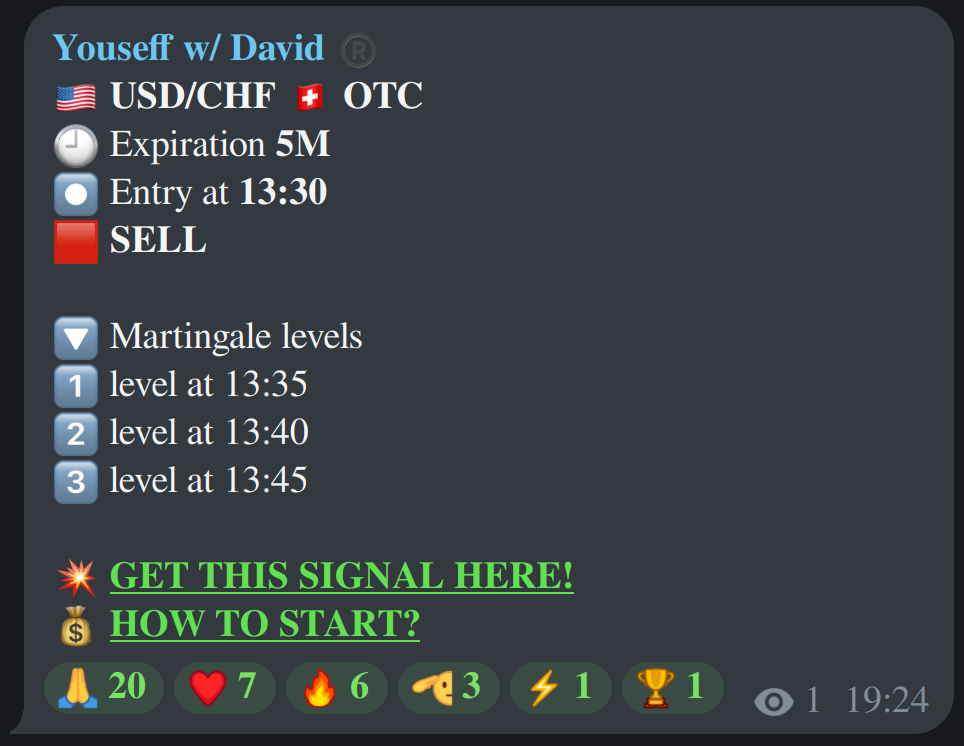
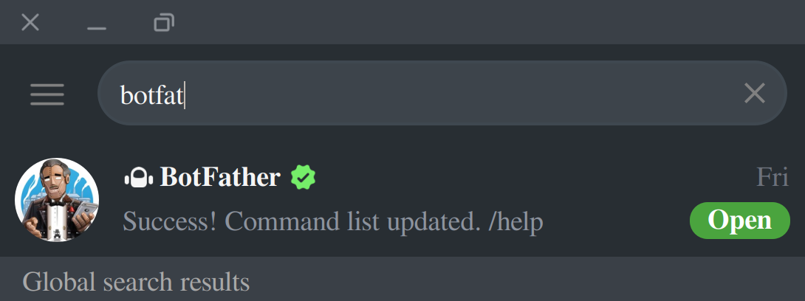
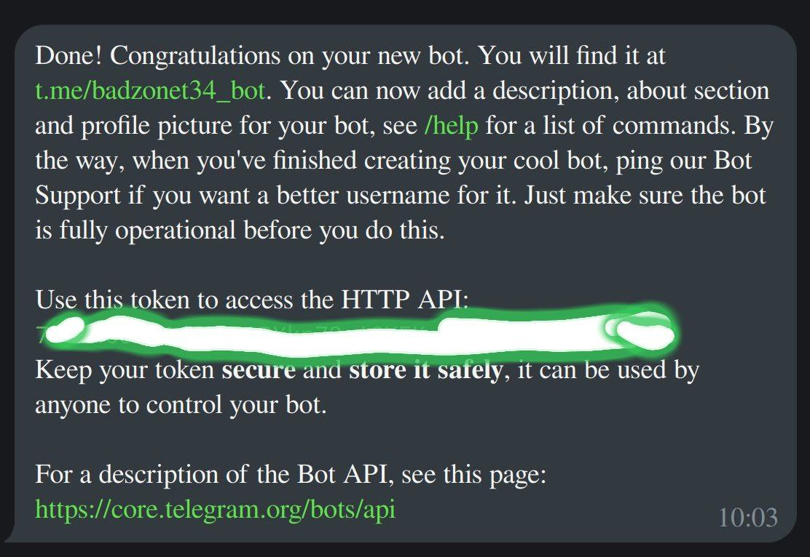

<h1 align="center">🤖 T34 — Telegram to PocketOption AutoTrader</h1>
<p align="center">
  
</p>

<p align="center">
  <b>AI-powered signal listener and binary options trader.</b><br/>
  <i>Built for PocketOption. Controlled via Telegram. Powered by Python. Inspired by the legendary T-34 tank — strong, precise, unstoppable</i>
</p>

<p align="center">
  
  
  
  
</p>


### 📦 About This Repository

**T34** is a fully automated trading system that connects **Telegram** signals with **PocketOption** to execute binary options trades seamlessly.

This project was built out of real-life necessity — top-tier trading signals like **Youseff's** are consistent and valuable, but they require constant monitoring, with sessions spread across the entire day. That’s nearly 24 hours of attention daily — tough for those of us busy building our future.

So instead of missing out or burning out, I automated the grind.

T34 handles:
- 📩 Listening to Telegram signals
- 🎯 Executing trades via the PocketOption API
- 📊 Managing sessions, risk, and balance updates
- 📬 Sending clear reports and status notifications

> _No more sleepless nights staring at charts — let the bot do the boring work while you focus on your dreams._

More technical breakdowns and setup guides are below.

---

### ⚠️ Disclaimer: Use at Your Own Risk

**Pocket Option does not provide any official API** for automating trading tasks. Automated bots are not allowed on their platform, and using one _may lead to account suspension or banning_.

This project uses an **unofficial API**:  
[`PocketOptionAPI-v2`](https://github.com/Mastaaa1987/PocketOptionAPI-v2.git)

I’ve tested it on both **Demo** and **Real** accounts, and it works — _but_:

> 💥 **I am not responsible for how you use this bot.**

You're fully accountable for your actions. The code is provided under an open license for **educational purposes only**.  
Any misuse, ban, loss of funds, or violation of PocketOption’s terms is **100% your responsibility**.

---

### 📉 Disclaimer: Trading Involves Risk

Trading binary options involves **significant financial risk**. While automation can improve consistency, it does **not guarantee profits**. You may lose all or part of your investment.

This tool was built to reduce manual workload — not to promise financial returns.

> 🧠 Always trade responsibly, manage your risk, and never invest money you can't afford to lose.

---

### 🚀 Features – How T34 Works

The heart of this project is a fully automated **Telegram-based trading assistant** that connects to **Pocket Option** via an unofficial API.

The bot is named **T34**, inspired by the legendary *T-34 Russian tank*, known for its precision and power — just like this bot aims to be in your trading game.  
Feel free to name yours anything you want — I’ll show you how to do that later in the **How to Use** section.

---

### 🤖 How the Bot Works

- It listens to a specific **Telegram channel** (e.g. `Yousef Signals`) for new trade alerts.
- When a signal arrives in this format:

🛰️ Sample Signal Format

Below is an example of the signal the bot is built to understand and trade automatically:




- The bot **parses the message**, converts the `entry time` to your local timezone, and schedules a trade.
- When the entry time hits, the bot **automatically places a trade** on the Pocket Option platform.
- If the first trade **loses**, the bot executes up to **3 martingale levels** (higher risk, higher stake) based on the strategy shared by the signal owner.
- It notifies you at each step with:
  - ✅ Trade placed (including pair, time, direction, and amount)
  - ⏳ Waiting for entry
  - 🟢 Win / 🔴 Loss result for each trade
  - 📊 Total Profit/Loss
  - 📈 Daily report per session (Morning, Afternoon, Night, OverNight)
  - 📉 Account balance updates
  - 🔌 Bot status (online/offline, active/inactive)

---

> ⚠️ You can’t use **my** Telegram bot, but you **can build your own** using this repo.  
> I’ll walk you through that process in the [How to Use](#️how-to-use) section.

## 🚀 How to Use / Install

To get your own version of the T34 bot up and running, follow these 4 major steps:

1. **Clone this repo**
2. **Create your own Telegram Bot**
3. **Get your Telegram API credentials**
4. **Grab your PocketOption SSID**

---

✅ Make sure you have Python 3.9+ and git 2.39 installed.

## 1️⃣  Clone this Repo

Depending on your system:

#### 🔵 Windows (Git Bash / Terminal)
```bash
git clone https://github.com/yourusername/t34.git
cd t34
python -m venv .venv
source .venv/Scripts/activate
pip install -r requirements.txt
```

### 🟢 Mac / Linux
```bash
git clone https://github.com/yourusername/t34.git
cd t34
python3 -m venv .venv
source .venv/bin/activate
pip install -r requirements.txt
```

### Create a .env File
In the root folder of the project, create a new file named **.env:**
you can run 
```bash
touch .env
```
or create it manually

Then open it and paste this config structure:
```env
BOT_TOKEN=
Tel_API_ID=
Tel_API_HASH=
Tel_CHAT_ID=
PO_SSID=
DEMO=False
TZ=
```
We’ll show you how to fill these values in the next sections.
> Keep this.env file private — never upload it publicly.

## 2️⃣  🤖 Create Your Telegram Bot

To run T34, you first need a Telegram bot. Here's how to create one in less than 2 minutes:

### ✅ Step-by-step Instructions

1. **Open Telegram** and search for 👉 `@BotFather`  
   <div align="center">
     
   </div>

2. Click `Start` to open the BotFather menu.

3. Tap on `/newbot` and follow the prompts:
   - First, type a **name** for your bot (e.g., `T34 Boss`)
   - Then choose a **unique username** that ends in `bot` (e.g., `t34_boss_bot`)

4. BotFather will give you a **token** like: 123456789:ABCdEfGhIjKlMnOpQrStUvWxYz123456789

<div align="center">
  
</div>

5. Copy that token and paste it inside your `.env` file like this:

```env
BOT_TOKEN=123456789:ABCdEfGhIjKlMnOpQrStUvWxYz123456789
```

### 🎨 Customize Your Bot (/setcommands is required, Others are optional but Recommended)
Use the following BotFather commands to make your bot more professional:

/setdescription → Choose your bot and add a short intro (e.g., “T34 automates trades on PocketOption based on Telegram signals.”)

/setabouttext → Choose your bot and write a longer bio (e.g., “Built by BadZone to follow Youseff signals automatically.”)

/setuserpic → Upload a nice profile pic for your bot (any cool avatar or T34 logo)

/setcommands → Set the command list. Just copy and paste this:
```text
start - Start T34 bot
menu - Get the menu buttons
status - Get the status of the bot
report - Get report about sessions
activate - Activate the bot and api
deactivate - Stop the bot from trading
```
### 📌 Pro Tip
Once you're done, check your bot in Telegram search.
Pin it to your top chats so you can access it easily while trading.

---

## 3 ✅ Create a Telegram API ID & Hash
### 📬 Get your Telegram Chat ID
So you can properly configure the .env file.

### 🔑 Get Telegram API ID & API HASH
1. Go to Telegram Developer Portal
👉 Open this link in your browser: https://my.telegram.org/auth

2. Login with your Telegram account

3. Once logged in, click on **“API Development Tools”**

4. Fill in the form:

    **App title:** Choose any name (e.g., T34BotApp)

    **Short name:** (e.g., t34)

You don’t need to fill the URL fields

5. Click Create application

Once created, Telegram will show you:

**API ID**

**API HASH**

👉 Copy both values and paste them in your .env file like so:
```env
Tel_API_ID=your_api_id_here
Tel_API_HASH=your_api_hash_here
```

## 3.5  Get Your Telegram Chat ID
1. Search this bot in Telegram: **@userinfobot**

2. Click **Start**

3. It will show  first,Lang and User **ID** (⚠️ This is what we need — copy it)

👉 Now update your .env file:
```env
Tel_CHAT_ID=your_user_id_here
```

Now you’re good to go with both API_ID, API_HASH, and CHAT_ID.

## 4 🧠 How to Get PocketOption SSID (Session ID)
To allow the bot to log in and trade on your PocketOption account, you’ll need to extract your SSID (session cookie) from the platform.

> ⚠️ **Important Notice:**
> PocketOption does not provide any official API, and using automated tools may violate their terms of service. > You are 100% responsible for how you use this information.

### 🕵️ Where to Find the SSID
We won't explain it here for security and legal reasons, but you can:

1. 🔍 Search for: **How to get PocketOption SSID** on youtube

2. 📚 Or go to the official unofficial API used in this project:
👉 https://github.com/Mastaaa1987/PocketOptionAPI-v2

Inside that GitHub repo, look for the file:
📄 *How to get SSID.docx* in the root folder.
It contains detailed instructions with screenshots on how to extract your SSID manually.

### 🧪 Demo or Real Trading?
You can choose to trade using either:

1. 🧪 Demo Account (fake balance)

2. 💸 Real Account (actual money — high risk!)

To set this in the bot, we added a new flag in your .env file:
```env
DEMO=False
```
If you retrieved a demo account ssid set **DEMO=True** else leave it as **False** to trade on real account.
Make sure you configure these settings well, otherwise the bot won't trade.

---

## 🚀 How to Run the Bot
Once your environment is ready and your session is activated, you're one step away from launching your fully automated T34 bot.
```bash
python run.py
```
This command will:

Start the **Telegram listener** that watches for Youseff's signals

Start the **PocketOption API worker** that handles trades

Start **the Bot manager** that processes and filters duplicates

Start **the Telegram Bot** (T34 interface with command panel)

Start **the Auto Reporter** that summarizes session results


## 📡 Activate Telegram Session (Auto Mode)
T34 uses **Telethon** to listen to signals from Telegram.
You don’t need to manually generate the session file — it’s done automatically the first time the bot starts.

> 🧠 This step only happens once unless the session file is deleted.

### 🛠 How It Works
When T34 launches, it runs the Telegram listener in the background. This will:

1. Prompt you to log in using your **phone number**

2. Ask for the verification code from Telegram

3. Save a secure session file called:
```text
t34_session.session
```

The first time it runs, it will prompt:

> 📱 Your phone number

> 🔐 A code sent to your Telegram app

> Paste it in the console

Once completed, the session is saved, and you won't be asked again.

✅ From now on, the bot listens to the signals silently in the background.

This file will be created in the project root. It allows T34 to access the channel without logging in again.

---

## 🧾 Additional Information

1. ✅ The bot **uses your main Telegram account** (not a bot token) to **read signals** from the channel `@youseftraderofficial`. This means you **must be a member** of the channel for the bot to work.

2. 📊 The bot trades **binary options** via PocketOption based on signal messages posted in that Telegram channel.

3. 🧠 More channels will be added soon. To request support for your favorite signal channel, **message @newvey** on Telegram.

4. 🌍 You can now **set your own timezone** in the `.env` file to make sure trade scheduling is accurate no matter where you are.

---

## ⏱ Timezone Support (NEW FEATURE)

To make sure the bot trades exactly at the right local time — you can now set the timezone manually.

In your `.env` file, add this new key:

```env
TZ=Africa/Lagos
```

You can replace `Africa/Lagos` with your own timezone name. For example:

- `America/New_York`
- `Europe/London`
- `Asia/Dubai`
- `Africa/Lagos`

Check [this list of timezones](https://en.wikipedia.org/wiki/List_of_tz_database_time_zones) if you're not sure what yours is.

Once set, all trades will be converted from the signal’s default timezone (UTC-4/New York) to yours.

✅ This improves accuracy and ensures no more late entries or missed trades.

---
## 🐳 Docker Deployment (Optional but Recommended)
If you're serious about keeping your bot online 24/7, Docker is your best friend. It's a tool that helps you package your entire project — code, libraries, dependencies — into a single container that runs reliably on any system.

### 💡 Why Docker?
. ✅ Portable — Works the same on any OS (Windows, macOS, Linux, cloud VPS).

. ✅ Isolated — Keeps your bot separate from your main system.

. ✅ Auto-Restart — If the system crashes or reboots, Docker can bring your bot back up.

. ✅ Easy to deploy — Once built, just one command starts your bot.

. ✅ Lightweight — Based on python:3.11-slim for minimal footprint.

### 🧱 Dockerfile Overview
Your bot already includes a Dockerfile with:

Required system dependencies (build-essential, libpq-dev)

Installation of all Python packages from requirements.txt

Copying your bot files and .env file

Starting the bot using python run.py

> 📄 Dockerfile is already provided in the repo root.

### 🛠️ Step-by-Step: Build & Run
**1. Install Docker**
If you don't have Docker installed:
([Install Docker for Linux](https://docs.docker.com/engine/install/))
([Install Docker Desktop for Windows/macOS](https://docs.docker.com/desktop/))

**2. Build the Docker Image**
Inside the project folder, run:
```bash
docker build -t yourbotname:1.01 .
```
This will create a Docker image tagged as yourbotname:1.01. The name you call it doesn't matter just know that you will keep using the same name

**3. Run the Container**
Start your bot using:
```bash
docker run --env-file .env --name containername --restart always yourbotname:1.01
```

. --env-file .env: Loads environment variables into the container

. --name containername: Gives the container a name

. --restart always: Ensures the bot auto-restarts on crash or reboot

**4. 📦 Publishing to DockerHub (Optional)**
If you want to share your bot publicly or deploy on a remote server:
```bash
#if you don't have podman installed you can replace it with docker 

# Login
podman login docker.io
# Username: your_username
# Password: <your_password>

# Tag your image
podman tag localhost/yourbotname:1.01 docker.io/yourusername/yourbotname:1.01

# Push it
podman push docker.io/yourusername/yourbotname:1.01
```
Once pushed, anyone can pull your bot like:
```bash
docker pull yourusername/yourbotname:1.01
```

---

## ⚠️ Disclaimer

This project is for **educational and testing purposes only**.  
The PocketOption API used here is unofficial and may violate their Terms of Service.  
Use at your own risk — you are responsible for any financial loss or account ban.  
Always test with demo accounts before risking real money.


---

## 📄 License

This project is licensed under the **Apache License 2.0**.

Copyright 2025 BadZone

Licensed under the Apache License, Version 2.0 (the "License");
you may not use this file except in compliance with the License.
You may obtain a copy of the License at ([Apache](http://www.apache.org/licenses/LICENSE-2.0))

**Stay stealth, trade smart — T34.** 🫡✨
